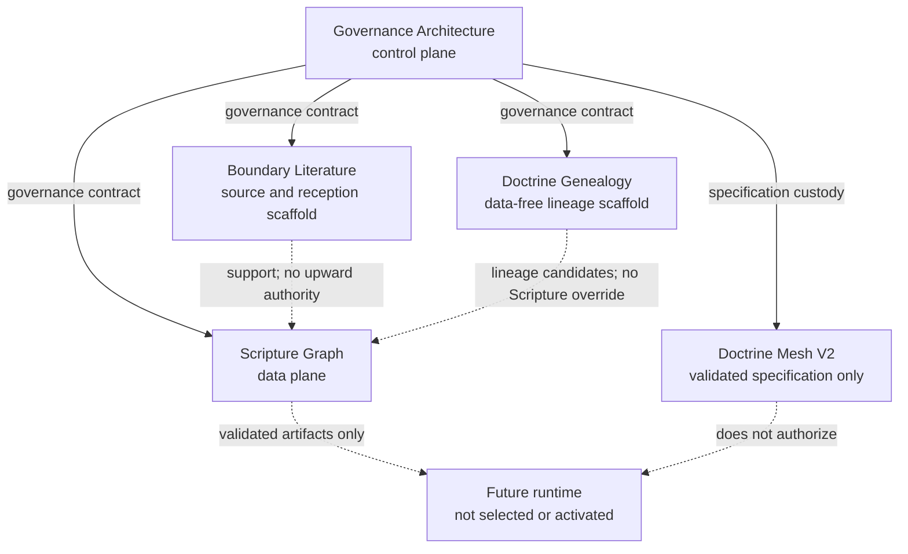
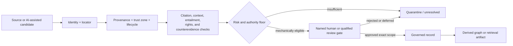
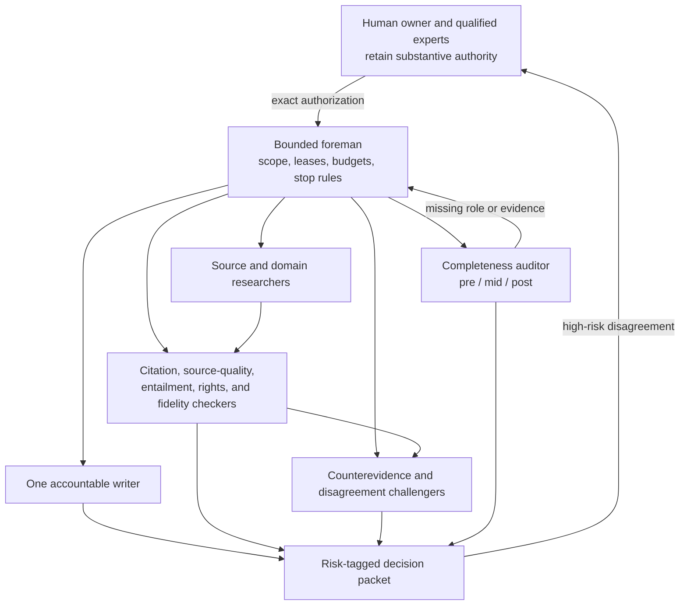
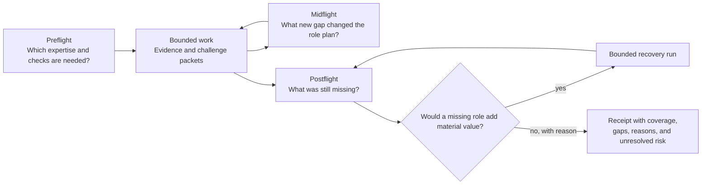
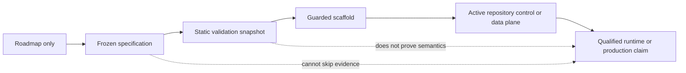

# Logos: engineering a trust layer for AI-assisted Christian knowledge work

I am building Logos as a long-horizon, multi-repository knowledge and governance
architecture for a difficult question:

> How can AI help with Scripture, history, doctrine, and institutional knowledge
> without letting model output quietly become source authority, theology, or an
> untraceable decision?

The answer is not a larger prompt. It is an inspectable trust layer: typed
evidence, explicit authority boundaries, provenance graphs, deterministic
validators, human gates, and bounded specialist-agent workflows that can be
challenged by other agents and by people.

This page is the public portfolio entry. The companion
[machine-readable evidence manifest](docs/portfolio/logos-trust-layer/project-evidence.yaml),
[schema](docs/portfolio/logos-trust-layer/project-evidence.schema.json),
[AI interrogation prompt](docs/portfolio/logos-trust-layer/AI-INTERROGATION-PROMPT.md),
and [validator](scripts/validate_portfolio_front_door.py) are designed so a
recruiter or engineer can point their own AI at the repository and ask it to
verify—not merely repeat—the story below.

## The one-minute brief

Logos demonstrates how I approach AI engagement and engineering when the cost of
confidently wrong output is high:

- separate source, interpretation, reception, doctrine, and workflow authority;
- make identity, provenance, trust, review, risk, and lifecycle state machine-readable;
- connect repositories through contracts instead of shared informal assumptions;
- treat graph edges, embeddings, summaries, and agent consensus as candidates,
  never self-certifying truth;
- use one accountable writer, independent checkers, specialist challenges,
  deterministic receipts, and human escalation for material disagreement;
- design the test harness, rollback boundary, source contract, and authority
  ceiling before selecting a runtime or scaling a worker mesh;
- publish honest maturity labels so a roadmap cannot masquerade as delivery.

The project is intentionally larger than a demo. Its architecture is meant to
support years of incremental work and, eventually, multiple contributors. The
current public surface already spans four repositories and thousands of tracked
artifacts; the most ambitious specialist-agent layer is a validated design, not
a running system.

## What exists—and what does not

| Surface | Honest maturity | What exists | Explicit limit |
|---|---|---|---|
| Governance control plane | Active control | Registries, schemas, trust zones, dependency maps, front doors, validators, and cross-repo contracts | Does not certify theology or production readiness |
| Scripture Graph | Active data plane | Deterministic Scripture-oriented data and validation architecture under the governance contract | It is not the agent runtime and this page does not claim a complete translation product |
| Boundary Literature | Active scaffold | Source/reception metadata, trust tiers, and contamination controls | It contains no admitted source-text corpus and cannot override Scripture authority |
| Doctrine Genealogy | Active data-free scaffold | Schemas, admission gates, profile scoping, and fail-closed validators | It is not a populated doctrine corpus and has no theological authority |
| Doctrine Mesh V2 | Validated specification only | A frozen 90-file design package: 85 payload files plus 5 administrative evidence files, static validator, fixtures, prompts, contracts, graph, and receipts | It is not a running system, not a completed doctrine corpus, and not qualified theological authority |
| Runtime, live research, and scale | Roadmap only | Contracts, decisions, risks, and activation prerequisites | No controller, source ingestion, substantive doctrine buildout, or deployment has been authorized here |

The exact definitions and snapshot commits are in the
[project evidence manifest](docs/portfolio/logos-trust-layer/project-evidence.yaml).
The repository counts there are path inventories—not capability scores. At the
four recorded public commits they total 4,035 tracked paths, including 249 JSON
and 676 YAML paths. Conservative path patterns identify 82 schema-like, 218
validator-like, and 274 test-like paths; categories overlap and say nothing by
themselves about semantic correctness.

## End-to-end architecture

### 1. Repository custody and authority



Plain-language reading: the governance repository owns shared contracts and
authority direction. Scripture, boundary/reception material, and doctrine
genealogy live in distinct planes. A lower-trust or supporting plane can supply
context but cannot silently acquire higher authority. The doctrine mesh is a
design artifact; its arrow to a future runtime is explicitly non-authorizing.

Evidence: [repository registry](governance/LOGOS_REPO_REGISTRY.yaml),
[data-flow map](DATA_FLOW_MAP.md), and
[repository link contracts](governance/REPOSITORY_LINK_CONTRACTS.md).

### 2. Candidate-to-governed-record lifecycle



Plain-language reading: AI may help find, normalize, compare, and test a
candidate. It may not promote itself. A missing locator, weak source, failed
entailment check, rights ambiguity, or unresolved human gate keeps the candidate
out of a governed record. Derived artifacts inherit—not erase—those limits.

Evidence: [minimum node schema](schemas/logos_node_min.schema.json),
[minimum claim schema](schemas/logos_claim_min.schema.json), and
[anti-guessing discipline](docs/governance/anti-guessing-and-evidence-discipline.md).

### 3. Hierarchical specialist mesh



Plain-language reading: this is a sparse, depth-one mesh, not a swarm where
workers create workers. Roles are assigned by evidence need and qualification,
not by a permanent model brand. One writer owns mutations. Separate checkers
verify citations, source quality, entailment, rights, translation fidelity, and
alignment. Material disagreement goes up to a person with the decision evidence
and dissent preserved.

The design includes 13 capability roles and 68 detailed domain profiles spanning
biblical languages, textual criticism, archaeology and ancient context,
Second-Temple and later Jewish contexts, patristics, historical theology,
Catholic and Protestant traditions, philosophy, rights, provenance, safety, and
evaluation. Those are role specifications and qualification targets—not a claim
that 68 experts or agents are currently staffed or qualified.

Evidence: [agent mesh](docs/roadmap/logos-stewardship-architecture-buildout/revisions/doctrine-mesh-v2/mesh/agent-mesh.v2.json),
[expertise taxonomy](docs/roadmap/logos-stewardship-architecture-buildout/revisions/doctrine-mesh-v2/mesh/expertise-taxonomy.yaml),
[role factory](docs/roadmap/logos-stewardship-architecture-buildout/revisions/doctrine-mesh-v2/mesh/autonomous-role-factory.yaml),
and [current release mesh](docs/portfolio/logos-trust-layer/agent-mesh-manifest.json).

### 4. Deterministic completeness audit



Plain-language reading: the mesh must ask at the beginning, during the work, and
at the end whether the right specialists and checkers are present. Missing roles
are not added for decoration; the auditor records what distinct failure they can
detect and whether that value is material. Inputs, outputs, timestamps, event
order, and receipts are schema-bound so the harness can detect a missing or
nondeterministic audit rather than accepting a prose claim that it ran.

Evidence: [completeness-auditor contract](docs/roadmap/logos-stewardship-architecture-buildout/revisions/doctrine-mesh-v2/mesh/completeness-auditor-contract.yaml),
[coverage-plan schema](docs/roadmap/logos-stewardship-architecture-buildout/revisions/doctrine-mesh-v2/mesh/coverage-plan.schema.json),
and [audit receipt schema](docs/roadmap/logos-stewardship-architecture-buildout/revisions/doctrine-mesh-v2/mesh/audit-receipt.schema.json).

### 5. Provenance graph and reverse blast radius


Plain-language reading: provenance is not a footnote. It is part of the graph.
If a source, license, review, or freshness state changes, the system design calls
for reverse traversal to find affected claims, edges, views, and consumers. A
weaker or stale input cannot remain hidden beneath a confident downstream answer.

Evidence: [governance dependency map](governance/GOVERNANCE_DEPENDENCY_MAP.yaml),
[staleness propagation contract](docs/roadmap/logos-stewardship-architecture-buildout/revisions/doctrine-mesh-v2/graph/staleness-propagation-contract.yaml),
and [consumer index schema](docs/roadmap/logos-stewardship-architecture-buildout/revisions/doctrine-mesh-v2/graph/consumer-index.schema.json).

### 6. Maturity is a one-way evidence ladder, not a marketing shortcut



Plain-language reading: passing schema and fixture checks can move a design to a
validated specification. It cannot jump directly to a production claim. Runtime
qualification requires new evidence about actual providers, tools, data, rights,
budgets, failures, security, users, and human approval.

## The doctrine-mesh specification

The Doctrine Mesh V2 package included in this release is the deepest design artifact in
this release. It contains:

- authority, autonomy, risk, decision, budget, and human-gate contracts;
- a bounded role factory and expert-completeness auditor;
- source authority, ExpertPack (a scoped expert/source/qualification package), citation, entailment, translation,
  rights, and provenance contracts;
- 18 internal prompts for writing, checking, challenging, routing, and recovery;
- a 25-node / 26-edge design graph and reverse-consumer contracts;
- schemas for attempts, events, receipts, coverage, role gaps, decisions, source
  manifests, qualifications, and controller evidence;
- negative fixtures, red-team and premortem repairs, a deterministic validator,
  19 passing adversarial/static tests, frozen digests, and independent review.

The package’s own receipt reports 66 parsed structured files, 13 capability
roles, 68 domain profiles, zero static audit failures, zero internal Markdown
link failures, and 19 tests passing. Its independent review is deliberately
described as `partly_verified_non_authorizing`; cross-provider independence is
not claimed.

Most importantly: this is **validated design, not a running system**. It is
**not a completed doctrine corpus** and **not qualified theological authority**.
No controller was activated, no source corpus was ingested, no ExpertPack was
qualified, no substantive doctrine decision was made, and no model or agent may
alter the Word of God or satisfy a human theological gate.

Inspect the [specification README](docs/roadmap/logos-stewardship-architecture-buildout/revisions/doctrine-mesh-v2/README.md),
[frozen revision manifest](docs/roadmap/logos-stewardship-architecture-buildout/revisions/doctrine-mesh-v2/revision-manifest.yaml),
[saved-version index](docs/roadmap/logos-stewardship-architecture-buildout/revisions/doctrine-mesh-v2/FINAL-SAVED-VERSION.yaml),
[validation receipt](docs/roadmap/logos-stewardship-architecture-buildout/revisions/doctrine-mesh-v2/checks/validation-receipt.json),
and [independent review](docs/roadmap/logos-stewardship-architecture-buildout/revisions/doctrine-mesh-v2/checks/independent-review.json).

## Why this is a trust layer

The trust layer is the combination of five engineering properties:

1. **Custody:** repositories and namespaces have explicit authority direction.
2. **Provenance:** claims and graph edges retain source, transformation, review,
   freshness, rights, and uncertainty lineage.
3. **Challenge:** citations, entailment, counterevidence, representation, and goal
   alignment are checked by roles other than the writer.
4. **Determinism:** schemas, fixtures, digests, validators, and receipts make
   bounded properties replayable without trusting the model that produced them.
5. **Human reservation:** Scripture, source authority, exegesis, doctrine,
   tradition policy, privacy, publication, and other material decisions remain
   with named people and qualified reviewers.

These patterns are transferable. A theological knowledge system makes the
authority problem unusually visible, but the same architecture applies anywhere
an AI answer must show where it came from, what it can prove, what changed
downstream, who checked it, and who still owns the decision.

## Potential value—clearly separated from delivery

With qualified contributors and separately authorized implementation, Logos
could support:

- a Christian nonprofit’s source-aware institutional knowledge and decision work;
- manuscript-, Hebrew-, Aramaic-, Koine-Greek-, and translation-aware evidence
  routes for Bible study and scholarship;
- doctrine slices that preserve historical witnesses, traditions, disputes,
  councils, reception, and minority positions without flattening them;
- specialist research meshes spanning biblical studies, languages, Jewish and
  ancient contexts, archaeology, early Christianity, patristics, medieval and
  Reformation theology, philosophy, rights, provenance, safety, and evaluation;
- audit-ready AI engagement patterns for other high-consequence knowledge domains.

Those are roadmap horizons. They require actual rights-cleared sources,
qualified human specialists, domain decisions, implementation, runtime and
provider qualification, privacy/security work, evaluation, user testing, and
fresh publication authority. They are not current product claims.

## What this work demonstrates

For an AI engineering or engagement role, the project provides inspectable
evidence of:

- systems architecture across a repository family;
- knowledge-graph, ontology, taxonomy, and schema design;
- provenance, source quality, risk, rights, lifecycle, and trust modeling;
- deterministic validation, negative testing, continuous integration (CI) contracts, and release gates;
- hierarchical agent orchestration with constrained authority and peer challenge;
- long-run campaign design, resumability, budgets, receipts, and safe stopping;
- red-team, premortem, disagreement, and human-decision routing;
- translating high-level responsible-AI goals into code-reviewable controls;
- explaining a complex system honestly to both people and AI tools.

I do not ask a reviewer to accept that list on trust. Use the interrogation route
below and follow the evidence.

## Let your AI interrogate the project

1. Open the [AI interrogation prompt](docs/portfolio/logos-trust-layer/AI-INTERROGATION-PROMPT.md).
2. Give it this repository plus the
   [project evidence manifest](docs/portfolio/logos-trust-layer/project-evidence.yaml)
   and [schema](docs/portfolio/logos-trust-layer/project-evidence.schema.json).
3. Ask it to classify every claim by maturity, resolve each evidence link, rerun
   deterministic checks when possible, and list unsupported or overstated claims.
4. Require it to distinguish structure from semantics, design from runtime, and
   a human gate from an agent opinion.

The full evidence map and suggested questions are in the
[portfolio packet](docs/portfolio/logos-trust-layer/README.md).

## Reproduce the bounded checks

From a clone of this repository:

```bash
python scripts/validate_portfolio_front_door.py
python -m pytest tests/test_portfolio_front_door.py
python docs/roadmap/logos-stewardship-architecture-buildout/revisions/doctrine-mesh-v2/checks/validate_doctrine_mesh.py --mode final
python docs/roadmap/logos-stewardship-architecture-buildout/revisions/doctrine-mesh-v2/checks/test_validate_doctrine_mesh.py
python scripts/validate_internal_links.py --all-markdown
```

Read the [public validation receipt](docs/portfolio/logos-trust-layer/validation-receipt.json)
for the exact candidate, commands, results, independent reviews, and limitations.
A passing command proves only the contract that command states.

## Start inspecting

- [Portfolio evidence packet](docs/portfolio/logos-trust-layer/README.md)
- [Machine-readable evidence](docs/portfolio/logos-trust-layer/project-evidence.yaml)
- [AI interrogation prompt](docs/portfolio/logos-trust-layer/AI-INTERROGATION-PROMPT.md)
- [Governance AI front door](AI_FRONT_DOOR.md)
- [Repository family map](LOGOS_FAMILY_MAP.md)
- [Cross-repository data flow](DATA_FLOW_MAP.md)
- [Doctrine Mesh V2 specification](docs/roadmap/logos-stewardship-architecture-buildout/revisions/doctrine-mesh-v2/README.md)
- [Stewardship architecture campaign](docs/roadmap/logos-stewardship-architecture-buildout/README.md)
