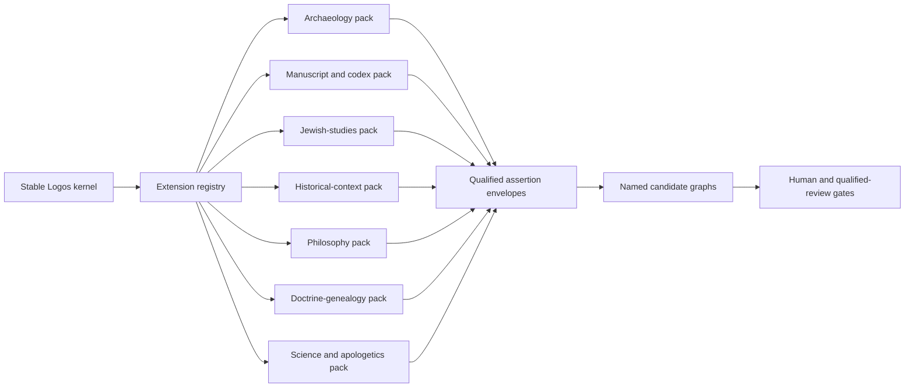
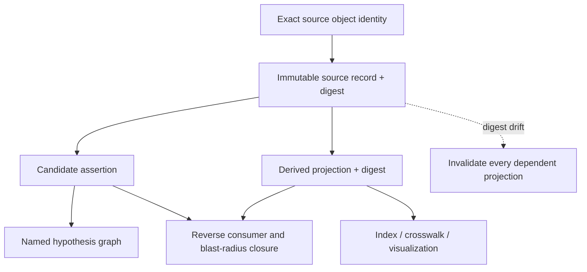

# Academic Extension Contract

## Status and authority boundary

This is a validated-design candidate, not a running system, an ingested corpus,
an approved domain pack, qualified academic review, or theological authority.
It does not decide doctrine, canonicity, exegesis, source fitness, tradition
policy, rights, publication, or academic truth. Those decisions remain with the
named human owner and, where required, qualified domain reviewers.

The contract is additive. It defines how future evidence may be represented and
checked. It does not add a single real archaeological, manuscript, historical,
Jewish, philosophical, scientific, doctrinal, or apologetic assertion.

## Goal

Keep a small, stable Logos kernel while allowing unbounded, independently
versioned domain packs. A pack may add a namespace, schemas, candidate
assertions, source records, projections, mappings, and specialist-review
requirements. It may not rewrite kernel meaning or gain authority by being
connected to a high-trust node.

The design must remain able to represent, without lossy remodeling:

- biblical archaeology and material-culture evidence;
- Hebrew, Aramaic, Greek, and other manuscript witnesses, codices, editions,
  apparatus records, translations, and textual variants;
- ancient Near Eastern, Egyptian, Babylonian, Persian, Greek, Roman, and other
  contextual material;
- Second Temple and other historically scoped Jewish movements, teachers,
  interpretive traditions, institutions, and disagreements;
- reception history, councils, patristics, scholasticism, Aquinas, Reformation
  sources, denominational traditions, heresies, and doctrine genealogy;
- philosophy before and after Christianity, including carefully scoped
  Aristotelian and Platonic concepts and their reception;
- apologetic questions and relevant scientific disciplines without turning a
  scientific result into doctrine or a doctrine claim into scientific data;
- academic extensions not yet anticipated by this repository.

## Stable kernel and domain packs

The boxes name possible pack classes, not approved packs. The production
registry is intentionally empty in this revision.

Kernel stability is enforced through three rules:

1. Pack-only changes must leave the recorded kernel contract byte-identical.
2. A pack uses its own stable namespace and version; it cannot mint a competing
   grammar for a kernel object.
3. Unknown pack data lives inside a schema-identified `extension_payload` with
   an exact canonical payload digest. The local fixture must round-trip without
   changing that value. A future consumer or adapter must separately prove the
   same preservation behavior before activation; consumers may not silently
   drop, reinterpret, or promote unknown data.

## Contract objects

| Object | Purpose | It explicitly does not prove |
|---|---|---|
| `academic_domain_pack_manifest` | Names a pack, version, namespace, schemas, mappings, reviewer classes, rights reference, and kernel pin. | Pack approval, source fitness, or academic truth. |
| `academic_source_record` | Preserves immutable source identity, edition/version, custody, locators, provenance, rights, and uncertainty. | That the source is correct, canonical, licensable for every use, or relevant to a claim. |
| `academic_assertion_envelope` | Represents a qualified n-ary candidate claim with roles, provenance, uncertainty, hypothesis state, and graph context. | Truth, doctrine, exegesis, or human approval. |
| `academic_derived_projection` | Separates an index, summary candidate, feature extraction, crosswalk, or visualization from its source. | New authority or permission to overwrite the source. |
| `academic_extension_registry` | Pins the kernel and records packs plus every declared downstream consumer. | Activation, compatibility beyond recorded evidence, or release. |

## Qualified n-ary assertions

A binary triple is often too small. “Object A is related to context B” loses who
made the observation, in what role, under which method, during what time and
place, with what measurement and uncertainty, and against which alternatives.

The assertion envelope therefore requires:

- a typed predicate;
- two or more named roles rather than one concatenated subject/object string;
- temporal, spatial, measurement, and uncertainty qualifiers;
- one or more immutable source-record references;
- an explicit method and asserting agent;
- alternative hypotheses and falsifiers;
- a named graph with `default_winner: false`;
- an authority effect of exactly `none`;
- a lossless extension payload.

Graph exports may project an envelope into triples, JSON-LD, tables, or search
indexes. The envelope remains the lossless source object, and a projection must
be reversible or identify its loss explicitly.

## Disagreement and named graphs

Competing hypotheses live in distinct named graphs. The default graph contains
no automatic winner. Majority vote, model confidence, embedding proximity,
citation count, or graph centrality cannot select the winner or raise authority.

An unresolved plurality is valid data. `candidate`, `competing`, `unresolved`,
and `incommensurable` are legal states. A future human-reviewed conclusion must
be a separately authorized object that preserves the competing graphs and the
decision record; it may not rewrite their history.

## Context is not doctrine

Archaeology, ancient religions, Egyptian or Babylonian history, Greco-Roman
culture, Jewish movements, philosophy, and scientific findings may illuminate
historical setting, terminology, reception, comparison, or a bounded apologetic
question. They cannot, through this contract:

- ground, revise, promote, or demote Christian doctrine;
- determine canonical Scripture or its meaning;
- overwrite Scripture, a manuscript witness, an edition, or a translation;
- become a hidden normative premise because a graph path reaches doctrine;
- collapse distinct Jewish, Christian, philosophical, scientific, or ancient
  religious viewpoints into one synthetic voice.

Non-Christian and contextual material belongs in its named domain and trust
graph. Any proposed relationship to doctrine is a candidate comparison with an
explicit authority ceiling, source chain, uncertainty, and human gate.

## Source records and derived projections

Source records are immutable content-addressed identities. Corrections create a
new record or a superseding record; they do not silently edit the old payload.
Derived objects carry the exact source digest and the fixed rule
`invalidate_on_source_digest_drift`. A projection whose source digest changes is
stale until replayed and reviewed.

Rights are multidimensional: access does not imply quotation, transformation,
retention, model transmission, embedding, redistribution, or publication.
`unknown` and `restricted` remain first-class values and require review.

## Uncertainty without false precision

Time, place, and measurement are structures, not decorative strings. Each value
records precision and certainty; measurements additionally record unit,
uncertainty, and method. Unknown values remain unknown. Approximate or ranged
claims may not be rounded into false exactness by an exporter.

## External standards are adapters

The native Logos envelope is the lossless authority-preserving record. External
standards are revision-pinned interoperability targets, not governance
authority. Mappings are `non_exact_by_default`; this contract deliberately does
not offer `exact_match`.

Useful adapter evidence includes:

- [RDF 1.2 Concepts](https://www.w3.org/TR/rdf12-concepts/) for graph and dataset
  concepts;
- [JSON-LD 1.1](https://www.w3.org/TR/json-ld11/) for linked-data serialization;
- [SHACL](https://www.w3.org/TR/shacl/) for graph constraint patterns;
- [PROV-O](https://www.w3.org/TR/prov-o/) for provenance vocabulary;
- [SKOS](https://www.w3.org/TR/skos-reference/) for bounded concept mappings;
- [Web Annotation](https://www.w3.org/TR/annotation-model/) for selectors and
  annotations;
- [TEI P5](https://www.tei-c.org/release/doc/tei-p5-doc/en/html/index.html) for
  textual scholarship, manuscripts, stand-off markup, and customization;
- [IIIF Presentation API 3.0](https://iiif.io/api/presentation/3.0/) for
  interoperable presentation of digitized objects;
- [CIDOC CRM version records](https://cidoc-crm.org/versions-of-the-cidoc-crm)
  for cultural-heritage mappings. The March 2026 7.3.2 entry is labeled draft;
  an adapter must not describe it as an official stable release.

Adapters must preserve native identity, qualifiers, uncertainty, rights,
provenance, hypothesis context, and authority ceiling. If a target cannot carry
something, the export records the loss and retains a pointer to the native
object.

## Reverse consumers and compatibility

Every registered pack must enumerate every known consumer and its compatibility
evidence. A change to a pack, schema, source digest, mapping, rights record, or
authority field produces a reverse blast-radius set. Unknown consumers block a
compatibility claim. Deprecation preserves identity and migration history; it
does not delete evidence.

## Human decisions intentionally unresolved

This revision does not choose:

- canonical identity or IRI policy;
- a normative authority lattice;
- whether any external standard should ever become more than an adapter;
- promotion rules for derived projections;
- pack stewardship, conflicts, retirement, or succession;
- rights and access policy;
- a winner among competing hypotheses;
- qualified reviewer classes for real academic domains.

The machine may raise a risk or authority floor, but it may not lower one or
resolve these decisions.

## Deterministic validation boundary

`scripts/validate_academic_extension_contract.py` is an offline, provider-neutral
static validator. It checks schema registration, the empty production registry,
synthetic positive and adversarial fixtures, canonical digests, role uniqueness,
lossless extension payload round-trip, source/projection separation, digest
invalidation, non-exact mappings, named-graph no-winner semantics, authority
ceilings, and reverse-consumer closure.

A pass proves only those checks on the exact revision. It does not prove semantic
correctness, completeness, source quality, expert qualification, portability to
an untested runtime, or permission to activate a pack.

## Red-team and premortem repairs

| Failure mode | Early warning | Enforced response |
|---|---|---|
| Universal-schema creep | A pack changes a kernel grammar. | Kernel digest mismatch; stop. |
| Triple flattening | Roles or qualifiers become concatenated prose. | Negative fixture; reject. |
| Context becomes doctrine | Contextual evidence gains a grounding effect. | Authority must be `none`; stop and route to human review. |
| Hypothesis collapse | A default winner appears. | Named-graph rule rejects it. |
| Source/projection overwrite | A derivative embeds or replaces source payload. | Schema separation and digest checks reject it. |
| Unknown extension loss | A consumer drops unknown nested data. | Canonical round-trip equality required. |
| Namespace/version collision | Two packs reuse an identity at incompatible revisions. | Registry uniqueness and compatibility checks fail. |
| False precision | Unknown or approximate data becomes exact. | Structured precision, uncertainty, and method are required. |
| Reverse-blast gap | A pack has an undeclared consumer. | Consumer closure blocks compatibility. |
| Adapter overclaim | A mapping claims exact equivalence. | Mapping vocabulary excludes exact matches by default. |
| Rights-facet collapse | Access is treated as permission for model transmission, embedding, or publication. | All eight use facets are required independently; unknown or restricted routes to human review. |

This contract is intentionally resilient by preserving information and gates,
not by pretending every future academic discipline already fits a closed list.
