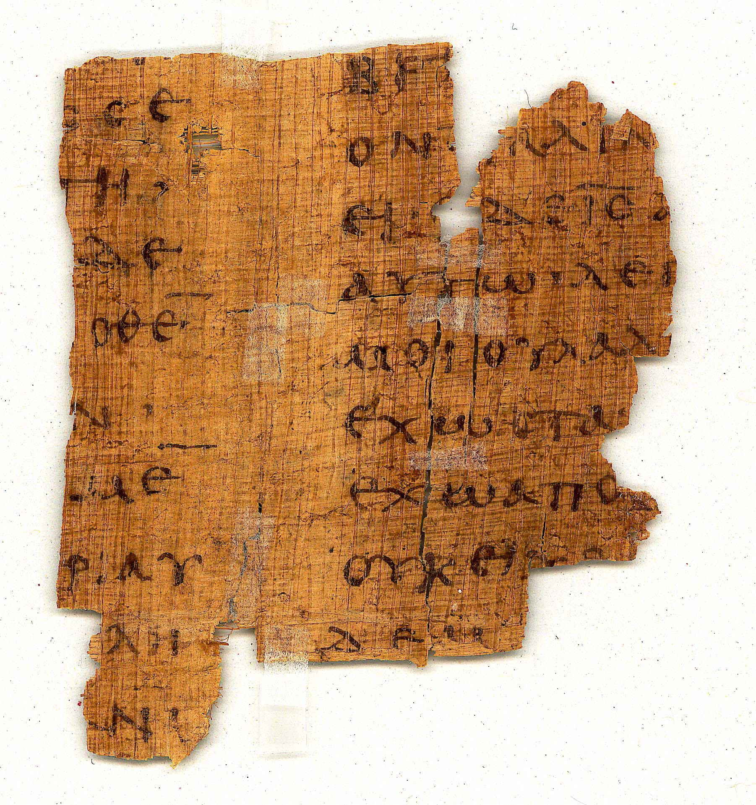
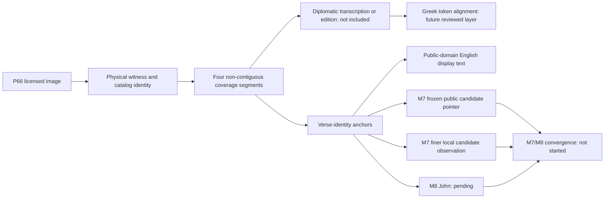
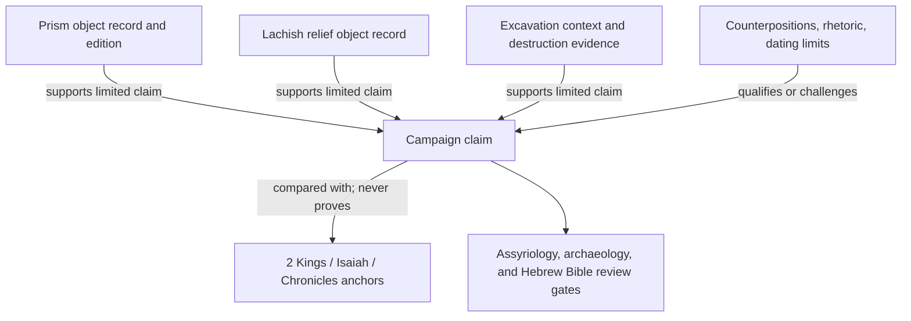

# Biblical Evidence Graph Demonstration V1

This is a real, source-linked academic demonstration of the Logos trust-layer
architecture. It is not a running system, not a completed archaeological corpus,
not a completed doctrine corpus, not a critical edition, not a preferred
biblical reading, and not reviewed-gold chunking. Every assertion is deliberately
narrower than the evidence that surrounds it.

Start with this page, then inspect the machine-readable evidence rather than
accepting the narrative on trust:

1. [`SCOPE.md`](SCOPE.md) — claims and nonclaims.
2. [`sources/archaeology-source-pack.yaml`](sources/archaeology-source-pack.yaml) — real cases, sources, alternatives, and limits.
3. [`sources/p66-source-and-rights.yaml`](sources/p66-source-and-rights.yaml) — exact image identity, byte proof, and CC BY 4.0 conditions.
4. [`graph/p66-chunk-crosswalk.yaml`](graph/p66-chunk-crosswalk.yaml) — four non-contiguous witness segments, public-domain English text, and chunk states.
5. [`graph/evidence-graph.yaml`](graph/evidence-graph.yaml) — claim-mediated nodes and edges.
6. [`graph/node-edge-catalog.yaml`](graph/node-edge-catalog.yaml) — extension-safe vocabulary and forbidden authority paths.
7. [`mesh/agent-mesh.v3.json`](mesh/agent-mesh.v3.json) — researcher, checker, rights, graph, and completeness-auditor separation.
8. [`checks/adversarial-fixtures.yaml`](checks/adversarial-fixtures.yaml) — claims the validator must reject.
9. [`release/public-release-manifest.yaml`](release/public-release-manifest.yaml) — exact maturity, asset, source, and release boundaries.
10. [`REPOSITORY_PLACEMENT.md`](REPOSITORY_PLACEMENT.md) — where future evidence belongs across the Logos repository family.
11. [`validation-receipt.json`](validation-receipt.json), [`release/independent-academic-review.md`](release/independent-academic-review.md), [`release/independent-rights-review.md`](release/independent-rights-review.md), and [`release/independent-graph-mesh-review.md`](release/independent-graph-mesh-review.md) — frozen replay evidence and explicit nonclaims.

## The P66 manuscript-to-chunk slice



© Institut für Altertumskunde an der Universität zu Köln. Image: *Inv.
04274+004298 / P.inv. 04274_04298v*, Kölner Papyrussammlung, TM 61627.
[Official object record](https://papyri.uni-koeln.de/stueck/tm61627).
Licensed [CC BY 4.0](https://creativecommons.org/licenses/by/4.0/).
The repository filename was normalized; the image bytes are unmodified and
match the official JPEG at SHA-256
`f7453af8d2523cc358148c7d26072d87b53c991aa03df667f8c5c54c7beef040`.
The University of Cologne does not endorse this project.

The object catalog assigns this fragment four separated portions of John 19:
8–11, 13–15, 18–20, and 23–24. The gaps matter. The validator rejects the
tempting but false simplification “John 19:8–24.”



Prose equivalent: a licensed photograph is first tied to a physical witness and
four cataloged regions. A separately sourced transcription and Greek alignment
would be required before anyone could claim text was read from the image. Verse
identities can already support a transparent crosswalk to a public-domain
English display and candidate chunk intersections. M8 has not reached John, and
no convergence result exists.

The immutable M7 public metadata snapshot exposes one coarse held candidate,
`M7_sol-John-009` (`John 18:1–19:42`). A later local corrective file contains
finer candidates `M7_sol-John-057` and `M7_sol-John-058`; that file is untracked
and therefore appears only as a non-durable observation, never as a public
endpoint or reviewed result. This distinction is part of the demonstration.

## Flagship archaeology case: Judah under Sennacherib

The slice places three evidence types beside one another:

- Assyrian royal inscriptions that name Hezekiah and tribute;
- palace reliefs depicting the attack on Lachish; and
- excavated destruction evidence at Lachish.

Together they support a bounded question about the Assyrian campaign in Judah,
conventionally dated to 701 BCE. They do not establish a complete harmonization
of 2 Kings 18–19, Isaiah 36–37, and 2 Chronicles 32, explain why Jerusalem was
not captured, or supply a theological cause. Royal inscriptions are also royal
self-presentation, not neutral modern histories.



Prose equivalent: objects and excavation contexts support or qualify a versioned
historical claim. Only that claim is compared with biblical passages. No artifact
has a direct “proves Scripture” edge, and no historical conclusion gains doctrine
authority.

The supporting cases are intentionally diverse:

- **Tel Dan:** the `bytdwd` sequence and the commonly proposed “House of David”
  reading are represented alongside published alternatives.
- **Pilate inscription:** surviving letters, restorations, translation, and
  interpretation remain separate; the minimal name/title claim does not prove a
  Gospel scene.
- **Jericho:** a chronology and stratigraphy stress test that keeps Garstang's
  excavation interpretation, Kenyon's different final stratigraphy, Middle
  Bronze radiocarbon limits, a recent Late Bronze synthesis, and the current
  expedition report distinct—not a confirmation or disproof scoreboard.
- **Hittite reception:** a control against collapsing Hatti, Neo-Hittite polities,
  biblical ethnonyms, and later apologetic rhetoric into one claim.

## Why this demonstrates a trust layer


Prose equivalent: the system preserves where information came from, what it can
support, who challenged it, which transformations occurred, and which decisions
remain human. Graph reachability, model agreement, citation count, or confidence
cannot silently convert contextual evidence into Scripture or doctrine authority.

## Academic and engineering status

| Surface | Current status |
|---|---|
| P66 image identity and redistribution | Byte-verified; CC BY 4.0; attribution required |
| P66 catalog coverage | Four explicit non-contiguous segments |
| Diplomatic transcription / critical edition | Referenced as a required layer; not ingested |
| English display text | Included from the public-domain `eng-web` source snapshot, with markup removal disclosed |
| M7 | Candidate-only; public metadata is held; finer local observations are non-durable |
| M8 | 22/66 at the observed checkpoint; John not built |
| M7/M8 convergence | Not started |
| Archaeology assertions | Source-linked candidates; qualified human review remains required for synthesis |
| Graph/runtime | Validated static design; no runtime is activated |
| Doctrine authority | None |

## Replay

From the repository root:

```powershell
python scripts/validate_biblical_evidence_demo.py
python -m pytest tests/test_biblical_evidence_demo.py -q
```

A passing validator proves only structure, exact asset identity, required source
and rights fields, crosswalk consistency, relation endpoint kinds, lower-trust
path rejection, exhaustive source-to-claim projection, graph/chunk state
consistency, bounded role permissions, changed-input completeness receipts,
forbidden-edge rejection, frozen digests, and declared status labels. It does not prove historical truth,
transcription accuracy, translation quality, doctrine, or expert approval.
