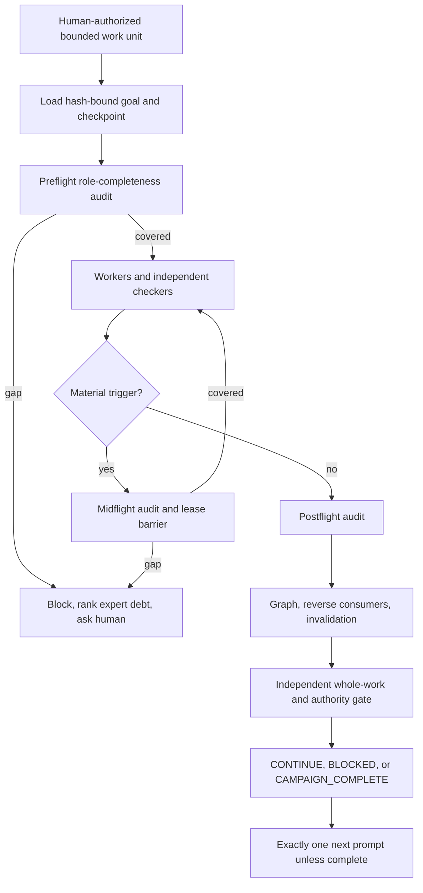
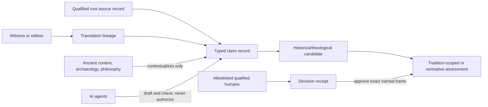

# Doctrine Marathon V3

Doctrine Marathon V3 is a **specification-only control-plane package**, not a
running system, completed doctrine corpus, or theological authority. Verify the
exact frozen validation and review status from this revision's manifest and
receipts rather than this prose. It specifies how a future campaign may
coordinate hundreds or thousands of bounded research units while keeping source
claims, historical description, tradition-specific testimony, normative
assessment, and human approval separate.

V3 is additive. It does not modify or supersede the frozen
[Doctrine Mesh V2](../doctrine-mesh-v2/README.md). V2 remains the reusable role,
source, authority, and audit-contract foundation. V3 adds a durable marathon
goal, canonical launch and resume prompts, chronological/dependency routing,
event-driven invalidation, ranked expert-review debt, weekly fresh-context
gates, a terminal next-prompt contract, and a public-safe status projection.

## What this package solves

- Long context is not treated as memory or authority. Every run resumes from
  schema-valid, digest-bound state.
- A deterministic completeness auditor checks role coverage before, during, and
  after every material unit. A separate qualification auditor checks whether
  the assigned roles have the required source packs and narrow expertise.
  ExpertPacks, qualification receipts, and correlation exceptions resolve
  through one typed registry; a design-time fixture cannot qualify runtime work.
  Entry, material-trigger midflight, and exit events bind the exact qualified
  completeness-auditor assignment, runtime bundle, capability set, use time,
  and requirement-set digest. Every action result separately resolves an exact
  checker assignment, actor, attempt, governed role/capability contract, and
  evidence digest.
- A writer never self-certifies. Citation, source fitness, entailment, context,
  translation, counterevidence, graph lineage, prompt alignment, and authority
  boundaries receive distinct checks. Concrete assignment receipts expose
  actor, attempt, prompt authorship, answer context, source order,
  KnowledgeGuide lineage, and runtime-adapter correlation. Each bundle has one
  total-coverage meta-checker and one whole-work checker that checks it. Runtime
  prompts and independent neutrality reviews bind the full assignment scope.
- A completed check is a typed, non-authorizing evidence receipt rather than a
  green flag. It binds the latest applicable completeness event, qualified
  producer, two qualified independent reviewers, exact output, evidence set,
  capability requirements, reviewer decisions, and deterministic use time.
  An accepted correlation exception must bind an immutable runtime-bundle ID
  and exactly one ledger-reachable checker-to-target relation; an orphan cannot
  authorize anything.
- Future evidence must resolve through a typed evidence registry. Root source,
  quotation/transcription, translation lineage, influence hypothesis, and claim
  status remain separate. Reviewed states require exact-scope, digest-bound
  specialist receipts; the current evidence and qualification registries are
  deliberately empty. ExpertPack source manifests and fixture outputs must also
  resolve by exact file digest; a pack cannot self-qualify with hash-shaped text.
- Historical labels such as orthodoxy and heresy are recorded as claims made by
  identified actors, councils, traditions, or documents. No model may emit an
  autonomous theological verdict.
- Dependencies point from consumer to prerequisite. Reverse consumers are
  generated, so stale or corrected evidence deterministically quarantines every
  affected descendant. Authority-plane taints are recomputed transitively, so
  contextual material cannot be laundered through a historical intermediate
  into Scripture, tradition, normative, or public projections. Every node binds
  an exact content file and every load-bearing edge carries the exact
  prerequisite content identity.
- Missing qualified experts become ranked review debt, not silent approval.
  Later scholars can navigate both prerequisites and consumers to see what to
  review and what their review could change.
- Every terminal state emits exactly one next prompt unless the campaign is
  genuinely complete. A fresh task is required at least weekly and whenever a
  material context boundary changes. `CAMPAIGN_COMPLETE` additionally requires
  an exact human-approved completion definition, all-unit coverage receipt, and
  zero blocking or high-risk residuals; it is impossible in this release.
- Human approval cannot be represented by an arbitrary name. A NormativeFrame
  must bind an allowlisted qualified signer, exact scope, human-decision receipt,
  dates, and digests; the current authority registry is deliberately empty.
- Digests prove byte and relationship consistency, not a person's identity or
  competence. Generation-zero qualification therefore requires an explicit
  bounded human bootstrap decision. A future runtime additionally needs a
  maintainer-pinned protected commit or verifiable signature; neither exists in
  or is implied by this specification release. The V3 validator therefore
  rejects every active human-identity root instead of accepting a self-reported
  human flag.

### Reusable root-auditor boundary

The repository-local V3 validator binds the complete canonical
`completeness-auditor-v3.yaml` object and rejects any changed facet, phase
binding, qualification rule, omission rule, recovery path, independence rule,
proof/nonclaim boundary, or hard-fail code until the validator and independent
review are deliberately revised together. This closes silent field-removal
drift inside V3.

The separate reusable `mesh-completeness-audit` control is an external tool,
not evidence embedded in this public package. Its current portable adapter
accepts `dad.task_local_agent_mesh_manifest.v1`; V3 declares
`logos.doctrine_marathon.agent-mesh.v3`. Therefore V3 does **not** claim that
the external tool audited this frozen package. Before any future runtime may
claim that protection, it must supply a reviewed provider-neutral wrapper or
adapter, prove complete material-field mapping, and bind the exact projection,
scope, predecessor chain, checker evidence, and audit receipts. V3's broader
`checks_assignment_ids` graph is an operational review graph; it must not be
misrepresented as the external audit artifact's finite coverage topology.

### Aggregate adversarial-harness containment

The public [root-fix report](checks/ADVERSARIAL_HARNESS_ROOT_FIX.md) and
[portable contract](checks/DETERMINISTIC_ADVERSARIAL_HARNESS_CONTRACT.md)
explain the systemic false-green failure mode, cross-package migration state,
and recurrence controls.

The reusable `dad.deterministic_adversarial_harness.v4` control and its V3
registry/discovery contract passed independent activation review, but this V3
package does not yet have a bound repository registry, clean-checkout adapter,
V4 receipt index, or CI execution evidence. The source inventory is 197 cases:
164 older membership/component fixtures plus 33 exact-ordered isolated
component regressions. Four high-risk source cases also have local copied-root
aggregate sentinels; they are a subset of the 197, not four additional source
cases, and they remain non-authorizing until V4 receipts, registration, CI, and
unchanged-head review exist. None is aggregate release evidence yet. The older
hand-maintained `193` total and its unsupported `43/36/85` buckets are invalid;
78 legacy candidates currently fail first on a rule other than the one they
claim to exercise. Those cases require dependency resealing or semantic
redesign rather than automatic rule refreezing. The machine-readable
[migration state](checks/adversarial-harness-migration.yaml) therefore assigns
V3 the public maturity `blocked_specification_only` and blocks final release
validation until exact repository discovery, one current V4 receipt per
governed case, complete aggregate baseline/candidate replay, dependency
resealing, CI execution, and independent unchanged-head review are complete.

## Public maturity boundary

| Capability | State |
| --- | --- |
| Specification, schemas, fixtures, and validator | Authored and reviewable |
| Public V3 maturity | Blocked specification-only; not a validated release |
| V4 aggregate harness migration | Four-case local sentinel passes; full registry, receipts, adapter, and CI remain open |
| Doctrine Mesh V2 parent | Frozen validated specification |
| Marathon runtime/controller | Not implemented or activated |
| Patristic source packs | Planned; no source ingested or qualified here |
| Substantive doctrine research | Not started by this package |
| Qualified theologian review | Required and intentionally outstanding |
| Doctrinal, ecclesial, or canonical authority | None |

## Read order

1. [Constitution](constitution.yaml)
2. [Canonical master prompt](DOCTRINE_MARATHON_MASTER_PROMPT.md)
3. [Durable goal](state/goal.yaml)
4. [Campaign graph](campaign.yaml)
5. [Agent mesh](mesh/agent-mesh.v3.json)
6. [Role catalog](mesh/role-catalog.yaml)
7. [Completeness auditor](mesh/completeness-auditor-v3.yaml)
8. [Concrete independence fixture](mesh/examples/design-time-independence-fixture.json)
9. [Runtime assignment-bundle schema](mesh/role-assignment-bundle.schema.json)
10. [Qualification registry](mesh/qualification-registry.json)
11. [Qualification-receipt schema](mesh/qualification-receipt.schema.json)
12. [Correlation-exception schema](mesh/correlation-acceptance-receipt.schema.json)
13. [Evidence registry](evidence/evidence-registry.json)
14. [Evidence-review receipt schema](evidence/evidence-review-receipt.schema.json)
15. [Event ledger](events/event-ledger.json)
16. [Patristic source qualification plan](research/patristic-source-qualification-plan.yaml)
17. [Father ExpertPack contract](research/father-expert-pack-contract.yaml)
18. [Environment ExpertPack contract](research/environment-pack-contract.yaml)
19. [Jewish-context pack schema](research/jewish-context-pack.schema.json)
20. [Epistemic integrity firewall](firewall/epistemic-integrity-contract.yaml)
21. [Trigger matrix](firewall/trigger-matrix.yaml)
22. [Action-to-checker requirements](firewall/action-checker-requirements.yaml)
23. [Prompt-neutrality contract](firewall/prompt-neutrality-contract.yaml)
24. [Fresh-context verification receipt schema](state/fresh-context-verification-receipt.schema.json)
25. [Dependency and invalidation contract](graph/event-driven-invalidation-contract.yaml)
26. [Influence-hypothesis schema](graph/influence-hypothesis.schema.json)
27. [Human-identity authority root](graph/human-identity-authority-root.yaml)
28. [Human-authority registry](graph/authority-registry.yaml)
29. [Campaign-completion definition](state/campaign-completion-definition.schema.json)
30. [Campaign-completion receipt](state/campaign-completion-receipt.schema.json)
31. [Expert-review debt contract](debt/review-debt-ranking-contract.yaml)
32. [Premortem](redteam/premortem.yaml)
33. [Repair ledger](redteam/repair-ledger.yaml)
34. [AI mistake escalation receipt](redteam/ai-mistake-escalation-2026-08-27.yaml)
35. [Validator instructions](checks/README.md)
36. [Bounded public-release authorization](checks/public-release-authorization.json)
37. [Final saved version](FINAL-SAVED-VERSION.yaml)

## Control flow

## Evidence and authority direction

The context edge has no normative force. Similarity does not prove borrowing,
influence, continuity, correction, fulfillment, orthodoxy, heresy, or truth.

## First future research horizon

The proposed starting horizon is the earliest Christian reception material for
which exact sources, rights, editions, languages, and qualified reviewers can be
secured. The initial pilot candidate is **1 Clement source-pack qualification**,
not a settled date, attribution, doctrine claim, or authorization to ingest the
text. Dependency needs may route prerequisite work into Scripture, Second
Temple Jewish context, Roman history, Greek language, manuscript studies, or
other disciplines before chronological work proceeds.

## Deliberately absent

No source corpus, scraped web material, witness transcription, translation,
live runtime adapter, model credential, controller lease, doctrine node, heresy
verdict, tradition ranking, or human approval is created by this revision.
