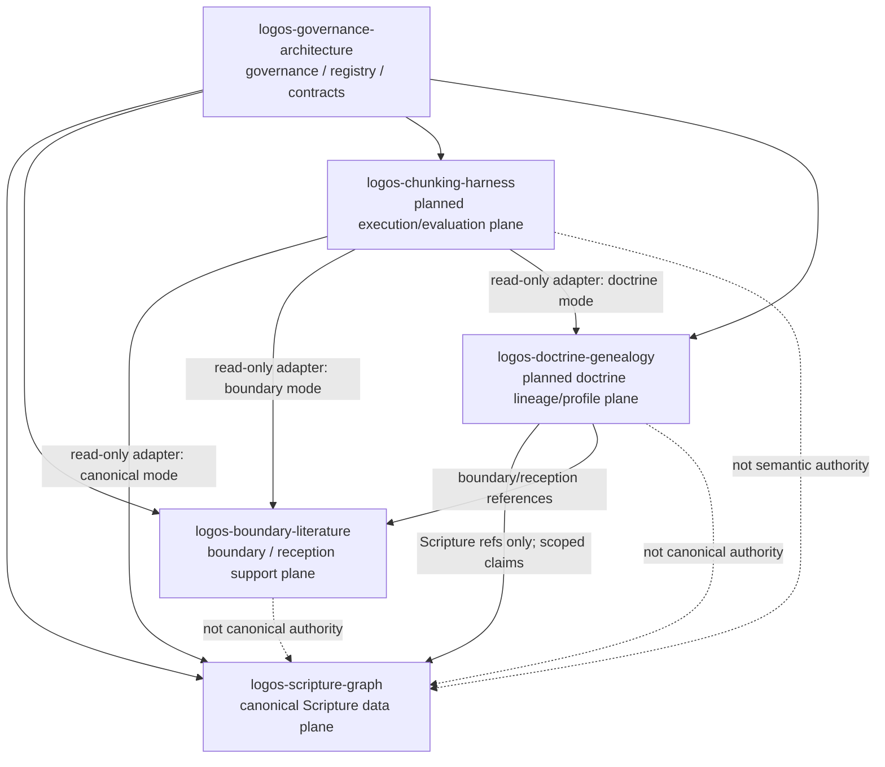

# Future Five Repo Architecture

This document records the intended future topology. The planned repos listed
here are not created by this document.

## Planned Repo Responsibilities

### logos-scripture-graph source-language horizon

`logos-scripture-graph` remains the owner for the future
manuscript/source-language Scripture evidence graph after source, licensing,
vocabulary, validation, and expert-review gates are satisfied.

The long-range root graph should be able to represent Hebrew, Aramaic, and
Koine Greek witness evidence where applicable, including manuscript witnesses,
fragments, transcriptions, variants, lemmata, morphology, syntax, lexical
evidence, and passage reconstruction. English translations, doctrine reports,
and apologetics products should be downstream views, not the root evidence
layer.

This horizon does not authorize AI to self-certify ancient-language expertise
or promote unreviewed Greek, Hebrew, or Aramaic analysis.

### logos-chunking-harness

Future execution/evaluation plane for chunking across corpora. It may read
Scripture, boundary, or doctrine repos through source-mode adapters, but it must
not own canonical truth, mix output namespaces, or transfer boundary claims into
Scripture.

Chunking, vectorization, retrieval-neighborhood generation, and graph-candidate
generation are execution/evaluation work. They may produce candidates, derived
artifacts, metrics, and review queues. They must not create Scripture authority,
doctrine authority, commentary-as-Scripture meaning, or governed graph edges
without source basis, scope, method, review status, and provenance.

It must not become the manuscript/source-language root graph.

### logos-doctrine-genealogy

Future doctrine/concept lineage and profile-comparison plane. It may track
doctrine development over time, source basis, ethical implications,
alignment/disalignment, denomination/profile scope, and
theologian-to-theologian influence, correction, reception, or divergence. It may
consume Scripture references from `logos-scripture-graph` and scoped
source/reception references from `logos-boundary-literature`. It must not
rewrite canonical Scripture, ingest commentary corpora as Scripture, or collapse
contested doctrine into universal truth.

## Commentary And Theology-Lineage Placement

Commentaries, church-father writings, patristic citations, ancient and modern
theologian writings, and reception-history source records route to
`logos-boundary-literature`. They are source and reception material, not
canonical Scripture.

Denominational and theological development over time routes to the future
`logos-doctrine-genealogy` repo after registration. That repo should model how
doctrines, concepts, traditions, and theologians build on earlier ideas while
preserving tradition/profile scope.

Unified evidence or apologetics products may join the repos only as derived
artifacts. They must preserve hard namespaces such as `scripture_*`,
`boundary_*`, `doctrine_*`, and `evidence_*`; a `canonical_*` table or view must
never include commentary, patristic, theologian, or denomination-profile data.

## Creation Gate

Each planned repo remains `planned_not_created` until:

1. a registration issue is opened in this repo;
2. authority and data-flow direction are approved;
3. an initial scaffold PR creates an `AI_FRONT_DOOR.md`;
4. the registry is updated in this governance repo first or in the same
   coordinated PR.

The first scaffold PR for any planned repo must include a README and either an
`AI_TABLE_OF_CONTENTS.md`, a data map, or a documented exception. Repos that
touch source, tradition, denomination, or profile data must also include
source-trust rules, scope rules, and validation commands before real corpus or
lineage records are added.

Repos that touch chunking, vector indexes, retrieval neighborhoods, or graph
edge generation must include anti-guessing and evidence-discipline rules before
the first executable pipeline is treated as governed infrastructure.

## When Creation Is No Longer Premature

A planned repo should be created only when its first concrete task cannot be
handled safely inside an existing active repo without distorting authority,
source ownership, runtime boundaries, or trust scope.

`logos-doctrine-genealogy` is ready only when doctrine lineage,
denomination/profile comparison, or theologian-to-theologian development needs
its own scoped records rather than more boundary source metadata.

`logos-chunking-harness` is ready only when cross-corpus execution/evaluation
needs runtime or adapter behavior that should not live inside Scripture,
boundary, or doctrine-lineage source-truth repos. It is not ready merely because
semantic search, embeddings, or graph edges sound useful. It becomes ready when
there is a concrete evaluation or adapter task plus source-mode boundaries,
namespace separation, anti-guessing rules, and validation commands.
