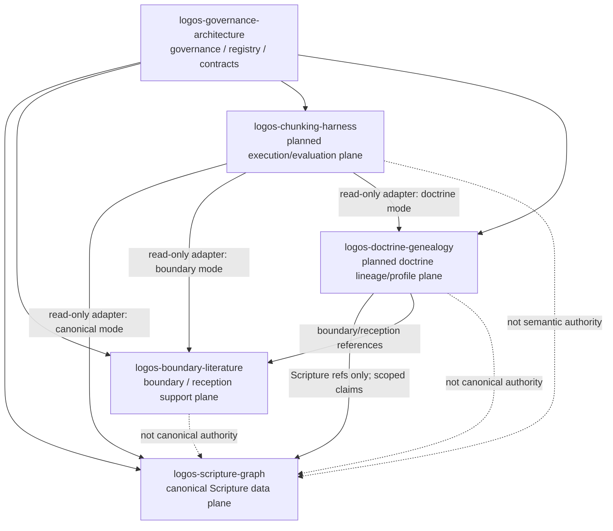

# Future Five Repo Architecture

This document records the intended future topology. The planned repos listed
here are not created by this document.

## Planned Repo Responsibilities

### logos-chunking-harness

Future execution/evaluation plane for chunking across corpora. It may read
Scripture, boundary, or doctrine repos through source-mode adapters, but it must
not own canonical truth, mix output namespaces, or transfer boundary claims into
Scripture.

### logos-doctrine-genealogy

Future doctrine/concept lineage and profile-comparison plane. It may track
doctrine development over time, source basis, ethical implications,
alignment/disalignment, and tradition/profile scope. It must not rewrite
canonical Scripture or collapse contested doctrine into universal truth.

## Creation Gate

Each planned repo remains `planned_not_created` until:

1. a registration issue is opened in this repo;
2. authority and data-flow direction are approved;
3. an initial scaffold PR creates an `AI_FRONT_DOOR.md`;
4. the registry is updated in this governance repo first or in the same
   coordinated PR.
